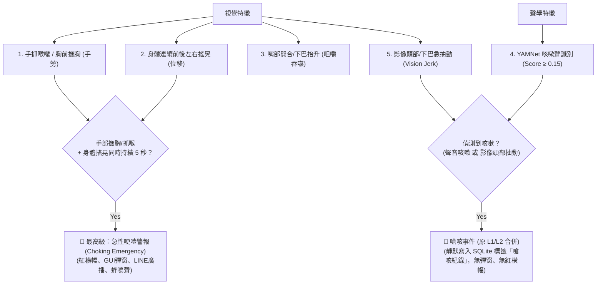

# 🛡️ 防哽咽即時監測系統 —— 專案進度與技術架構彙整報告

**專案名稱**：基於多模態邊緣運算之防哽咽即時監測與預警系統  
**報告目的**：彙整目前硬體裝置、網路拓撲、演算法判斷邏輯（哽噎/嗆咳/吞嚥特徵）與最新研發進度，供協作團隊及評審迅速瞭解系統全貌。

---

## 📐 一、系統硬體裝置與網路拓撲彙整

本系統採用 **「前端採集 + 邊緣 AI 計算 + 雙網路備援 + 視訊/控制台前端」** 的分工架構：

```mermaid
graph TD
    A["ESP32-S3 Sense<br/>(前端採集節點)"] -->|方案B: Wi-Fi (80/81) / 方案A: USB Serial| B["Raspberry Pi 4B<br/>(邊緣 AI 大腦 - Python 3.12)"]
    A -->|USB CDC / COM4| C["PC / 筆記型電腦<br/>(本地測試與 UI)"]
    B -->|wlan0 (局域網 192.168.68.x)| D["網頁控制台 Web UI<br/>(Port 8080)"]
    B -->|wlan1 (AP 熱點 aaaa 10.42.0.1)| C
```

### 1. 各核心硬體規格與職責

| 裝置名稱 | 硬體規格 / 晶片 | 主要功能與職責 |
| :--- | :--- | :--- |
| **ESP32-S3 Sense** | Seeed Studio XIAO ESP32S3 (雙核 240MHz, 8MB PSRAM) | **前端高畫質與音訊採集**：搭載 OV2640 鏡頭與板載 PDM 數位麥克風（GPIO 41/42），即時捕捉進食者頭部畫面與呼吸/咳嗽聲音。 |
| **Raspberry Pi 4B** | 樹莓派 4B (aarch64, 佈署 Python 3.12 獨立環境) | **邊緣 AI 計算核心**：執行 MediaPipe 骨架/臉部辨識、YAMNet 聲音模型、多模態融合決策演算法、SQLite 資料庫與 Web UI Server (8080)。 |
| **PC / 筆記型電腦** | Windows 10/11 (雙網卡: 內建 + USB 網卡) | **開發、調校與本地 UI 顯示**：提供本地演算法調試介面、安裝 `arduino-cli` 自動燒錄韌體，並透過外接網卡連入樹莓派熱點。 |

### 2. 雙連線傳輸方案

* **方案 B (現有 Wi-Fi 模式)**：ESP32-S3 連接樹莓派廣播之 `aaaa` 熱點，於 Port 80 提供 MJPEG 畫面（`/stream`），於 Port 81 提供 16kHz PCM 音訊。
* **方案 A (USB 序列埠模式 - 轉換中)**：ESP32-S3 經由 USB CDC 實體線直接連線，以自訂二進位封包標頭 Multiplexing 傳輸影像與音訊，免除 Wi-Fi 干擾。

---

## 🧠 二、哽噎與嗆咳之判定邏輯與特徵資訊

本系統不依賴單一特徵，而是採用 **「多模態時間窗特徵融合演算法 (Multi-modal Temporal Evidence Fusion)」**，綜合**手勢、身體掙扎加速度、咳嗽聲學與進食吞嚥狀態**進行精準分級警報。



### 1. 關鍵特徵指標定義

#### (1) 手抓喉嚨/撫胸拍胸特徵 (A1 國際通用窒息手勢 & 拍胸求救)
* **喉嚨與胸口感應區 (Throat & Chest Zone)**：以鼻尖至下巴連線延伸為中心，自適應覆蓋脖子與下顎下方 1.35 倍頭高之胸前核心區域。
* **手部骨架追蹤**：使用 MediaPipe 追蹤 21 個手部關節點。
* **防送餐誤判機制**：手部停留必須與身體晃動同時持續滿 5 秒方會確認哽噎，徹底避開拿湯匙或抓癢等短暫掠過的誤判。

#### (2) 身體晃動特徵 (連續多軸位移分析)
* **無因次化位移 (Scale-Invariant Displacement)**：追蹤鼻子關鍵點 $p_4$ 的位移量，除以人臉尺寸：
  $$\text{norm\_disp} = \frac{\Delta \text{position}}{\text{face\_size}}$$
* **多軸往返反轉與持續性判定**：在滑動時間窗內統計位移量與前後左右往返反向次數（Reversals $\ge 2$），確保過濾微小咀嚼或常態性微晃。

#### (3) 咳嗽特徵 (聲學 YAMNet + 視覺 Jerk 雙流偵測)
* 透過 16kHz 採樣率音訊串流輸入 Google YAMNet 模型（咳嗽信心度 $\ge 0.15$），或影像下巴快速抽動震幅特徵。
* **L1 / L2 合併為「嗆咳」 (靜默後台紀錄)**：**取消劇烈晃動條件**（移除原 L2 中 `body_shaking` 強制綁定）。偵測到咳嗽時**僅背景寫入 SQLite 資料庫（標籤為 `嗆咳紀錄`），不會跳出 UI 彈窗、不閃紅橫幅、不發干擾警報**。

#### (4) 咀嚼吞嚥與自主進食歷程追蹤
* 狀態機歷程：`張嘴 (食物入口)` $\rightarrow$ `閉嘴 (咀嚼計算次數)` $\rightarrow$ `下巴上提 (定格吞嚥)` $\rightarrow$ `安全期`。
* **取消 4 秒發呆警報**：個案可依個人進食習慣安心充分咀嚼，移除「4秒咀嚼超時未吞嚥」之發呆警報，避免誤報彈窗打擾用餐。

---

### 2. 警報分級決策矩陣

| 警報/事件名稱 | 觸發條件組合 | 系統回應與處理 |
| :--- | :--- | :--- |
| **🚨 急性哽噎警報 (Choking Emergency)** | 手部抓喉/撫胸拍胸 ＋ 身體前後左右搖晃，**雙重動作同時持續滿 5.0 秒**。 | 最高優先級緊急警報！電腦/終端發出警示蜂鳴聲、Web UI / 視窗顯示紅色閃爍橫幅、跳出最上層 GUI 警報彈窗、異步廣播 LINE 通知並寫入 SQLite 資料庫。 |
| **🤫 嗆咳事件 (Cough Event - 原 L1/L2 合併)** | 偵測到咳嗽（聲音 YAMNet 咳嗽 或 影像頭部/下巴急抽動）。<br/>**★ 取消劇烈晃動條件**：移除原 L2 中 `body_shaking` 之強制綁定。 | **靜默後台紀錄**：僅於背景非阻塞寫入 SQLite 資料庫（標籤為 `嗆咳紀錄`），**絕不跳出 UI 彈窗、不閃爍紅橫幅、不發出刺耳警報聲與不發送干擾 LINE**。 |

---

## 📈 三、專案目前已完成進度總結

1. **樹莓派 Python 3.12 邊緣運算環境建置**：
   * 克服 Debian 13 / Python 3.13 缺少官方 MediaPipe aarch64 套件的問題，部署 Python 3.12 獨立 Toolchain（`/opt/anti-choke/python312`），順利啟用 MediaPipe 影像辨識。
   * 修復了 `tensorflow-hub` 在 Python 3.12 的 `pkg_resources` 廢棄相容性警告。
2. **多模態特徵優化與靈敏度調校**：
   * 喉嚨判定半徑由 $1.2$ 精準縮小至 $0.6$，並將確認時間由 4 幀升至 15 幀（0.5s），降低湯匙進食誤判。
   * 新增 Scale-invariant 身體劇烈晃動演算法與決策矩陣。
   * 隱藏「嘴唇發紺 (Cyanosis)」對應 UI，確保 DOM 元素安全。
3. **視覺化偵測範圍與節點標示**：
   * 實現 **🔴 紅色嘴部輪廓 (20點)**、**🌸 粉紅色喉嚨圈** 與 **🎛️ 橘黃色 21 關節手部骨架** 之即時 Overlay 繪製。
4. **開發與除錯自動化**：
   * 於 PC 安裝 `arduino-cli 1.5.1` 及 ESP32 核心驅動，實現背景自動編譯與燒錄。
   * 樹莓派 `wlan1` 外接網卡順利啟動 `aaaa` AP 熱點，實現本機電腦雙網卡直連（10.42.0.1）。
   * 為 Seeed Studio XIAO ESP32S3 Sense 編寫雙核心 FreeRTOS 影音串流程式（`esp32_wifi_streamer.ino`）與本機 Python UI（`pc_receiver_ui.py`）。

---

## 🚀 四、下一階段研發規劃 (Next Steps)

1. **方案 A (USB 序列埠) 最終部署**：
   * 燒錄自訂二進位 Multiplexing 封包之 Serial 韌體至 ESP32-S3，完成極低延遲實體傳輸測試。
2. **多個案場景與動態門檻適應**：
   * 支援個別個案的咀嚼時間門檻客製化設定（`shared/thresholds.json`）。
3. **現場實機測試與數據收集**：
   * 邀請協助團隊針對「正常用餐」、「拿湯匙進食」、「劇烈咳嗽」與「模擬卡喉手勢」進行綜合混淆矩陣 (Confusion Matrix) 測試。
